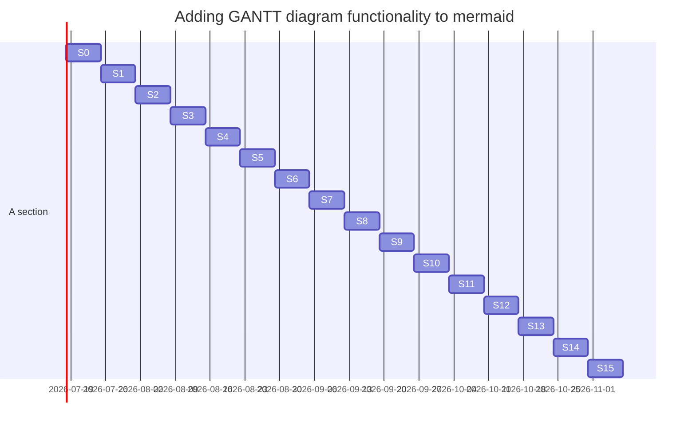

# Projektisuunnitelma pohja / sisältö

1. Toimeksianto
tausta ja lähtökohdat, tavoitteet ja tehtävät, rajaus ja liittymät, tulos

2. Projektiorganisaatio
organisaation esittely, vastuut ja päätöksentekoprosessi

3. Projektin vaiheet ja taloudelliset tavoitteet
tehtäväkokonaisuudet, osittelu ja vaiheistus, välitulokset, aikataulut ja resurssissuunnitelmat, budjetti

4. Laadun varmistus
menetelmät, standardit, hyväksymismenettely, muutosten hallinta, dokumentointi, katselmoinnit, riskien hallinta, muut täydentävät suunnitelmat

5. Tiedonvälitys ja projektin etenemisen seuranta
projektin aloitus, työtilat ja viestintävälineet, palaverikäytäntö ja yhteydenpito, raportointi ja tiedotus, projektikansio

6. Projektin päättyminen
luovutus, käyttöönotto, ylläpito, projektin aineiston taltiointi, arkistointi, loppuraportti, projektin virallinen päättäminen

## 1 Projektin ja lopputuotteen kuvaus

Tässä dokumentissa kuvataan X-projektin taustaa, tavoitteita, tehtäviä, vaihejakoa, resursseja ja organisaatiota. Vaihejaon yhteydessä on kuvattu jokainen vaihe erikseen lyhyesti.

## 1.1 Tausta ja lähtökohdat

Projektin tavoitteena on luoda sovellus, jonka avulla pystytään helposti katsomaan sään mukainen pukeutuminen halutulle sijainnille tai useammalle sijainneille yhdellä kertaa.
Projekti toteutetaan osana Jyväskylän ammattikorkeakoulun informaatioteknologian instituutin järjestämän <TTOS0800-TTOS0900 Ohjelmistoprojekti ja Järjestelmätestaus> ‑opintojaksoa.

## 1.2 Tavoitteet ja tehtävät

* Tuottaa ratkaisu
* Tuottaa toimiva demo (Proof Of Concept)
* Dokumentoida tehty työ
* Tuottaa toimiva sovellus tehdyn demon perusteella

Määritellään työn keskeisin sisältö tässä projektissa; projektin tehtävä liittyy projektin kohteessa kuvattuun kokonaisuuteen. 
< Mitä aiotaan tehdä?> / < Mitä toimintaa aiotaan kehittää ja miten?>
< Visio tulevasta tilasta> / < Mikä on tuotettava lopputulos (konkreettinen)?> / < Mitkä ovat osa- tai välitulokset?>
< Kenelle tulos tuotetaan?>
”Projektiryhmän tehtävänä on pitää eri tahot tietoisina projektin tilanteesta. Kunkin vaiheen päätyttyä laaditaan vaiheraportti, jonka avulla johtoryhmälle tiedotetaan projektin edistymisestä.”

## 1.3 Rajaus ja liittymät

* Käyttäjätietoja ei tallenneta sovelluksen ulkopuolelle

Täsmennetään projektin tehtävää rajaamalla ulkopuolelle jäävät osat kohteena olevasta järjestelmästä tai kokonaishankkeesta. Erikseen on syytä kuvata myös tehtävän suorittamista merkittävästi rajoittavat ulkoiset tekijät.

Tässä myös täsmennetään ne tehtäväkokonaisuudet, jotka nyt tehtävään osioon tulevat vielä todennäköisesti jossain vaiheessa liittymään, mutta joita ei tämän projektin puitteissa kuitenkaan tulla toteuttamaan. Tyypillisiä tällaisia tehtäviä voisivat olla mm. käyttöympäristön rakentaminen ja koulutus. Muina rajauksina voisi olla esim. ohjelmiston käyttöliittymässä käytettävä kieli.

Huom.: Projektiopintojakson aikana toteutettavalla projektilla ei saisi olla tiukkoja aikataulullisia liittymiä muihin toimeksiantajan projekteihin

## 1.4 Oikeudet

TODO

”Eri osapuolten oikeudet on määritelty projektisopimuksessa.” Ellei erillisessä sopimuksessa ole kerrottu oikeuksista työn tuloksiin, tulee ne ilmaista esim. tässä projektisuunnitelmassa. 

## 1.5 Termit ja määritelmät

TODO

Tässä kappaleessa esitellään projektisuunnitelmassa esiintyvät määritelmät, termit ja lyhenteet. Esimerkiksi eri projekteissa saattaa sanoilla "tarkastus" ja "katselmointi" olla eri merkitys ja tämä voi aiheuttaa väärinkäsityksiä. Joskus saattaa olla paikallaan sopia eri nimityksiä ryhmän tarkastuksille (oma sisäinen, asiakkaan kanssa, opintojakson suuntaan). Lyhenteet kannattaa avata alkuperäiskielelle ja lisätä lyhyt kuvaus suomeksi. Esimerkiksi CASE = Computer aided software engineering, tietokoneavusteinen systeemityö.

# 2. Projektiorganisaatio

## 2.1 Organisaation esittely

Projektin organisaation kuuluu Jyväskylän ammattikorkeakoulun opettajia, projektihenkilökunnan opiskelijoita, projektiryhmän ohjaajat sekä toimeksiantajan edustajat. Organisaatiokaavio on esitetty liitteessä <X>.”

**Projektiryhmä**

Projektiryhmä suorittaa projektille asetetut tehtävät ja tavoitteet käytettävissä olevien resurssien puitteissa. Projektille nimitetty projektin-johtaja toimii roolissan koko projekttin ajan.

Johtoryhmä

-

Tukiryhmä

-

## 2.2 Vastuut ja päätöksentekoprosessi

TODO

Mikko Vornanen

* Projektiryhmän julkisen nettisivun ylläpitö ja kehitys.

# 3. Projektin ajalliset tavoitteet	

## 3.1 Osittaminen ja vaiheistus

< Mitä vaiheita projekti sisältää? (Lyhyt kuvaus kustakin)> <Mitä tuloksia kustakin vaiheesta syntyy? >

Projekti koostuu neljästä eri vaiheesta: Aloitusvaihe, Käynnistysvaihe, Toteutusvaihe ja Lopetusvaihe.

Seuraavassa käydään jokainen vaihe, niiden vaatimat aikaresurssit ja tulokset läpi lyhyesti. Vaiheet ja niiden tehtävät kuvataan tarkemmin vaihesuunnitelmissa. Parhaillaan meneillään olevasta vaiheesta tulee olla tiedossa tarkasti kuka tekee ja kuinka paljon työtä tämän vaiheen tehtävien suorittamiseksi. Myöhempien vaiheiden työmääräarviot voidaan esittää alkuvaiheessa karkealla tasolla, jota sitten projektin edetessä tarkennetaan yksityiskohtaiselle tasolle. Tämä tapahtuu jokaisen vaiheen lopussa, jolloin suunnitellaan tarkemmin seuraava vaihe.

Aloitus p.k.vvvv – p.k.vvvv (X h)

Käynnistys p.k.vvvv – p.k.vvvv (X h)

Projektin käynnistämiseen kuuluu olennaisesti projektisuunnittelu ja suunnitteludokumenttien laatiminen sekä yhteydenpitokäytänteiden luominen toimeksiantajayrityksen kanssa. Vaiheen aikana tehdään esim. ryhmän webbisivut, tutustutaan tarkemmin toimeksiantoon, aloitetaan kohdealueeseen perehtyminen ja laaditaan projektisuunnitelma yhteistyössä toimeksiantajan edustajien kanssa. Vaiheen aikana muodostetaan johtoryhmä, pidetään 1. johtoryhmän kokous sekä allekirjoitetaan projektisopimus.
”Vaiheen tuloksia ovat ryhmän imagon (nimi, logo ym.) luominen, webbisivut tms. sekä projektisopimus liitteineen.”

Toteutus p.k.vvvv – p.k.vvvv (X h)

Lopetus p.k.vvvv – p.k.vvvv (X h)

”Lopettamisvaihe sisältää projektin päättämiseen liittyvät toimenpiteet. Vaiheen aikana projektiryhmä laatii projektin loppuraportin ja esityksen johtoryhmälle. Vaiheen aikana luovutetaan projektin tulos toimeksiantajalle, pidetään viimeinen johtoryhmän kokous viikolla X sekä puretaan projektin organisaatio. Lopettamisvaiheen tuloksena on projektin loppuraportti.”

# 4. Laadunvarmistus

Projektissa käytetään Git:iä ja GitLab:iä versionhallintaan ja dokumentoinnin säilyttämiseen sekä Gitlab Pages -ominaisuuttaa projektiryhmän verkkosivujen julkaisuun.

## 4.1 Väli- ja lopputulosten hyväksymismenettely

Tähän kirjataan se hyväksymismenettely, mikä projektissa on sovittu.

## 4.2 Muutosten hallinta

Kuvataan muutosten hallintaproseduuri projektinkäytäntöihin tai projektin tuloksiin liittyvien muutosten osalta. 

## 4.3 Dokumentointi

Dokumentointi tallennetaan omaan GitLab repositorioonsa (core). Kaikki dokumentit löytyvät tästä repositoriosta.

## 4.4 Riskien hallinta

Listataan riskit, arvioidaan niiden vakavuus ja todennäköisyys ja koetetaan miettiä toimenpiteet kuinka vakavimmat/todennäköisimmät riskit voitaisiin ehkäistä jo ennalta. Lisäksi olisi hyvä olla suunnitelma kuinka toimitaan, jos riski toteutuu.

Liitä seuraava osio tähän mukaan: [Riskienhallintataulukko]()

## 4.5 Katselmointikäytäntö

Luetellaan ja alustavasti aikataulutetaan projektin tuloskatselmukset laaditun toteutussuunnitelman pohjalta. Esitetään luettelomaisesti, mitä katselmuksia pidetään, alustava ajankohta, käsiteltävät asiat, osallistujat sekä käytännöt katselmointimateriaalin toimittamisesta (mitä, milloin, miten).

Linkit katselmointipöytäkirja pohjiin

## 4.6 Projektisuunnitelmaa täydentävät suunnitelmat

* Vaatimusmäärittely
* Riskienhallintasuunnitelma
* Toimeksiantajan video
* Viestintä suunnitelma

## 4.7 Suunnitelmien tarkistus- ja päivitysajankohdat 

Projektisuunnitelman avulla reagoidaan poikkeamiin ja ympäristömuutoksiin, joten sitä päivitetään projektin aikana. Tähän kohtaan kirjataan ne ajankohdat, jolloin suunnitelman ajantasaisuus ainakin on tarkistettava.

## 4.8 Projektin keskeyttämiskriteerit

Oikeaoppiseen projektisuunnitelmaan kuuluu myös projektin keskeyttämiskriteerit. Näitä ei kuitenkaan opiskelijaprojekteissa käytetä, koska projekteissa käytetään tietty tuntimäärä tuloksen tekoon ja tulos luovutetaan sellaisena, kun se opintojakson päättyessä on. Projektiryhmä tekee kuitenkin jatkokehityssuunnitelman, josta mahdollinen uusi projekti jatkaa.

# 5. Tiedonvälitys ja projektin etenemisen seuranta (viestintäsuunnitelma)

Projektin etenemistä seurataan viikkottaisella tapaamisella projektin tekoa varten. Sisäinen viestintä hoituu WhatsAppin kautta.

# 6. Projektin päättyminen

## 6.1 Lopputuotteen luovutus, käyttöönotto

Projektin lopputuote tulee myös dokumentoida järkevällä tasolla. Osana lopputuotetta saattaa olla asiakkaalle tarjottavaa käyttöönottokoulutusta ja mahdollisesti asennus- tai käyttöönotto­palvelua. Mikäli koulutuksen rooli projektin kannalta on huomattava (esimerkiksi ohjelmiston käyttäjät eivät ole olleet mukana projektissa ja eivät tiedä miten järjestelmä toimii) tulee projektisuunnitelmaan liittää suunnitelma asiakkaalle tarjottavasta koulutuksesta. Lisäksi jos on tarpeen, tulee projektisuunnitelmaan liittää myös asennussuunnitelma ja käyttöönottosuunnitelma.

## 6.2 Projektin tuottaman aineiston taltiointi, arkistointi ja säilytysaika

”Projektiryhmien dokumentaatiosta IT-instituutille jäävä osa tallennetaan GitHubiin.” Toimeksiantajan tulee selkeästi määritellä, mitkä dokumentit voidaan jättää opiksi seuraaville projekteille. Tyypillisesti eri suunnitelmat ja loppuraportti ovat tällaisia dokumentteja. 

## 6.3 Projektin virallinen päättäminen

On tärkeää määritellä milloin, mihin tai miten projekti päättyy. Projektin päätös voi olla tietty päivämäärä, tietty tuotteen valmiusaste, tietty työtuntimäärä, tietty kulutettu rahasumma, kun asiakas ottaa tuotteen käyttöön, takuuaika on umpeutunut tai kun asiakas hyväksyy tuotteen.

”Projekti päättyy p.k.vvvv, jolloin projektisopimuksen voimassaoloaika päättyy.”

## 6.4 Lopetustilaisuus

Yleensä projektit päätetään yhteiseen päätösseminaariin. Tähän kirjataan osallistujat ja ajankohta. 

## 6.5 Projektin loppuraportti

Projektin loppuraportti laaditaan viimeiseen johtoryhmän kokoukseen mennessä.

##Liitteet

Projektisuunnitelmaa täydentävät suunnitelmat esitetään liitteenä.

