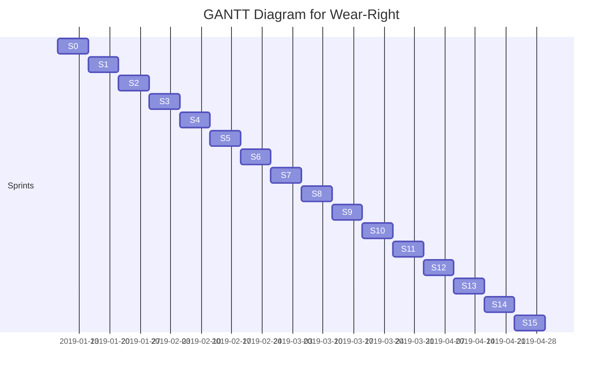

## 1 Projektin ja lopputuotteen kuvaus

Tässä dokumentissa kuvataan Wear-Right-projektin taustaa, tavoitteita, tehtäviä, vaihejakoa, resursseja ja organisaatiota.
Vaihejaon yhteydessä on kuvattu jokainen vaihe erikseen lyhyesti.

## 1.1 Tausta ja lähtökohdat

Projektin tavoitteena on luoda sovellus, jonka avulla pystytään helposti katsomaan sään mukainen pukeutuminen halutulle
sijainnille tai useammalle sijainneille yhdellä kertaa. Projekti toteutetaan osana Jyväskylän ammattikorkeakoulun
informaatioteknologian instituutin järjestämän <TTOS0800-TTOS0900 Ohjelmistoprojekti ja Järjestelmätestaus> ‑opintojaksoa.

## 1.2 Tavoitteet ja tehtävät

* Tuottaa ratkaisu
* Tuottaa toimiva demo (Proof Of Concept)
* Dokumentoida tehty työ
* Tuottaa toimiva sovellus tehdyn demon perusteella
* Testata sovellusta ja korjata mahdolliset viat
* Toimittaa valmis tuote toimeksiantajalle

Projektiryhmän tehtävänä on pitää eri tahot tietoisina projektin tilanteesta.

## 1.3 Rajaus ja liittymät

* Käyttäjätietoja ei tallenneta sovelluksen ulkopuolelle
* Projektin tekemiseen aikaa kurssin loppuun

## 1.4 Oikeudet

Projektin oikeudet kuuluvat toimeksiantajalle sopimuksen mukaan.

## 1.5 Termit ja määritelmät

Ei selitettäviä termejä.

# 2. Projektiorganisaatio

## 2.1 Organisaation esittely

Projektin organisaation kuuluu Jyväskylän ammattikorkeakoulun opettajia, projektihenkilökunnan opiskelijoita,
projektiryhmän ohjaajat sekä toimeksiantajan edustajat. Organisaatiokaavio on esitetty liitteessä <X>.”

**Projektiryhmä**

Projektiryhmä suorittaa projektille asetetut tehtävät ja tavoitteet käytettävissä olevien resurssien puitteissa.
Projektille nimitetty projektin-johtaja toimii roolissan koko projekttin ajan.

**Projektin ohjaaja**

Projektin ohjaajana toimii Marko "Narsu" Rintamäki. Projektin ohjaajaa ohjeistaa projektin teossa ja mahdollisissa ongelmatilanteissa.

**Toimeksiantajan edustaja**

Toimeksiantajan edustajana toimii toimeksiantaja itse. Hän huolehtii omien vaatimuksiensa välittämisestä projektin suhteen projektiryhmälle.
Ja valvoo, että projekti etenee hänen haluamaansa suuntaan.

## 2.2 Vastuut ja päätöksentekoprosessi

**Mikko Vornanen**

* Projektiryhmän julkisen nettisivun ylläpitö ja kehitys/Programming lead

**Claudia Viita**

* UI design

**Jesse Heikkinen**

* Koodaus

**Suvi Lauritsalo**

* Projektin testausvastaava

**Oskari Seppä**

* Koodaus

**Mikko Martikainen**

* Koodaus

# 3. Projektin ajalliset tavoitteet	

## 3.1 Osittaminen ja vaiheistus

Projekti koostuu neljästä eri vaiheesta: Aloitusvaihe, Käynnistysvaihe, Toteutusvaihe ja Lopetusvaihe.

### Aloitus 8.1.2019 – 15.1.2019 (X h)

Projektin alotusvaiheeseen kuului kurssien esittely ja projektiryhmien muodostaminen.

### Käynnistys 16.1.2019 – 19.2.2019 (X h)

Projektin käynnistämiseen kuuluu olennaisesti projektisuunnittelu ja suunnitteludokumenttien laatiminen sekä yhteydenpitokäytänteiden 
luominen toimeksiantajayrityksen kanssa. Vaiheen aikana tehdään esim. ryhmän webbisivut, tutustutaan tarkemmin toimeksiantoon, 
aloitetaan kohdealueeseen perehtyminen ja laaditaan projektisuunnitelma yhteistyössä toimeksiantajan edustajien kanssa. 
Vaiheen aikana muodostetaan johtoryhmä, pidetään 1. johtoryhmän kokous sekä allekirjoitetaan projektisopimus.
”Vaiheen tuloksia ovat ryhmän imagon (nimi, logo ym.) luominen, webbisivut tms. sekä projektisopimus liitteineen.

### Toteutus 19.2.2019 – 9.4.2019 (X h)

Toteutusvaiheessa aloitetaan projektin koodaaminen ja toteuttaminen käytännössä. Myös projektin testaaminen ja vikojen korjaaminen
kuuluu tähän vaiheeseen.

### Lopetus 9.4.2019 – 30.4.2019 (X h)

Lopettamisvaihe sisältää projektin päättämiseen liittyvät toimenpiteet. Vaiheen aikana projektiryhmä laatii 
projektin loppuraportin ja esityksen johtoryhmälle. Vaiheen aikana luovutetaan projektin tulos toimeksiantajalle, 
pidetään viimeinen johtoryhmän kokous viikolla X sekä puretaan projektin organisaatio. Lopettamisvaiheen tuloksena on projektin loppuraportti.

# 4. Laadunvarmistus

Projektissa käytetään Git:iä ja GitLab:iä versionhallintaan ja dokumentoinnin säilyttämiseen sekä Gitlab Pages -ominaisuuttaa projektiryhmän verkkosivujen julkaisuun.

## 4.1 Väli- ja lopputulosten hyväksymismenettely

Väli- ja lopputuloksen hyväksynnän suorittaa projektin ohjaaja sekä toimeksiantaja.

## 4.2 Muutosten hallinta

Mahdollisista muutoksista sovitaan projektiryhmän sisäisesti ja tarvittaessa hyväksytetään projektin ohjaajalla sekä toimeksiantajalla.

## 4.3 Dokumentointi

Dokumentointi tallennetaan omaan GitLab repositorioonsa (core). Kaikki dokumentit löytyvät tästä repositoriosta.

## 4.4 Riskien hallinta

Riskien hallinta löytyy alla olevasta linkistä.

[Riskienhallintataulukko](riskienhallinta.md)

## 4.5 Katselmointikäytäntö

Luetellaan ja alustavasti aikataulutetaan projektin tuloskatselmukset laaditun toteutussuunnitelman pohjalta. 
Esitetään luettelomaisesti, mitä katselmuksia pidetään, alustava ajankohta, käsiteltävät asiat, osallistujat 
sekä käytännöt katselmointimateriaalin toimittamisesta (mitä, milloin, miten).

Linkit katselmointipöytäkirja pohjiin

## 4.6 Projektisuunnitelmaa täydentävät suunnitelmat

* Vaatimusmäärittely
* Riskienhallintasuunnitelma
* Toimeksiantajan video
* Viestintä suunnitelma

## 4.7 Suunnitelmien tarkistus- ja päivitysajankohdat 

Projektisuunnitelman ajantasaisuus tarkistetaan aina jokaisen sprintin alussa.

## 4.8 Projektin keskeyttämiskriteerit

Projektilla ei ole keskeyttämiskriteereitä vaan se luovutetaan sellaisenaan kurssin loputtua.

# 5. Tiedonvälitys ja projektin etenemisen seuranta (viestintäsuunnitelma)

Projektin etenemistä seurataan viikkottaisella tapaamisella projektin tekoa varten. Sisäinen viestintä hoituu WhatsAppin kautta.

# 6. Projektin päättyminen

## 6.1 Lopputuotteen luovutus, käyttöönotto

Projektin lopputuote tulee myös dokumentoida järkevällä tasolla. Osana lopputuotetta saattaa olla asiakkaalle tarjottavaa 
käyttöönottokoulutusta ja mahdollisesti asennus- tai käyttöönotto­palvelua. Mikäli koulutuksen rooli projektin kannalta on huomattava 
(esimerkiksi ohjelmiston käyttäjät eivät ole olleet mukana projektissa ja eivät tiedä miten järjestelmä toimii) 
tulee projektisuunnitelmaan liittää suunnitelma asiakkaalle tarjottavasta koulutuksesta. Lisäksi jos on tarpeen, 
tulee projektisuunnitelmaan liittää myös asennussuunnitelma ja käyttöönottosuunnitelma.

## 6.2 Projektin tuottaman aineiston taltiointi, arkistointi ja säilytysaika

Aineisto säilyy JAMK:n gitlab palvelimella JAMK:n omien käytäntöjen määrittämän ajan.

## 6.3 Projektin virallinen päättäminen

Projekti päättyy 27.4.2019, jolloin projektin loppuraportti palautetaan projektin ohjaajalle.

## 6.4 Lopetustilaisuus

Palautetaan loppuraportti projektin ohjaajalle.

## 6.5 Projektin loppuraportti

TODO

## Liitteet

Projektisuunnitelmaa täydentävät suunnitelmat esitetään liitteenä.

