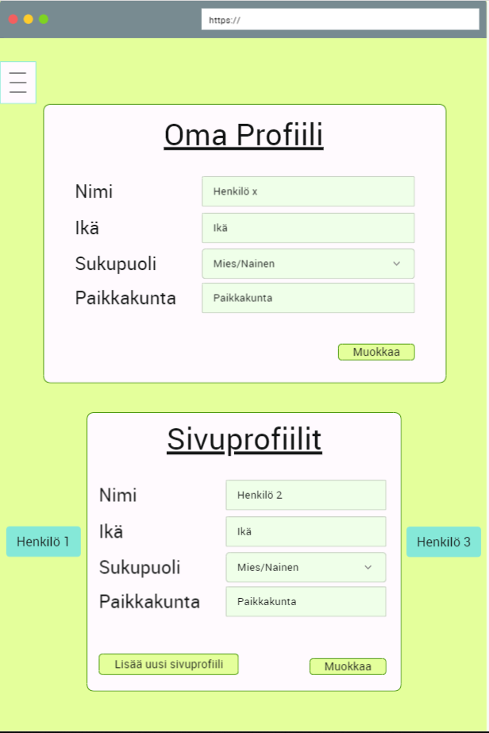

# Ominaisuus 2 - Sivuprofiilit

| | |
|:-:|:-:|
| Ominaisuus ID | FT02 |
| Osajärjestelmä | Tekninen |
| Ominaisuuden vastuuhenkilö | - |
| Status | Ei aloitettu |

### Kuvaus

Käyttäjä voi oman profiilin lisäksi tehdä sivuprofiileja, joille asuvalinnat voivat olla erilaisia iän ja sukupuolen mukaan. 

### Ominaisuuteen liittyvät rajaukset, vaatimukset käyttötapaukset

| | |
|:-:|:-:|
| FUNCTIONAL-REQ-C0002 | |

### Alustavat käyttäjätarinat (User Storys)

[#131 - As a user, I want to create one or more profiles because I need to see the outfits for multiple persons](#131)

### Käyttöliittymänäkymä/mock 

[Mockup](https://www.fluidui.com/editor/live/preview/cF9TeGhTZkFtcE04NGZCUHc5NTNMa3N4M1RwSDNrUzVOVg==)

### Testaus / mahdolliset hyväksyntä kriteerit 

| Testitapaus  | Testin lähde  | Kuka vastaa  |
|:-: | :-:|:-:|
| [Sivuprofiilia ei voi luoda syöttämättä hänelle ikää]()  | vaatimus id? |   |
| [Sivuprofiilia ei voi luoda valitsematta hänelle sukupuolta]()  | vaatimus id? |   |
| [Ikä voi sisältää vain numeroita]()  | vaatimus id? |   |
| [Nimi voi sisältää vain aakkosia]()  | vaatimus id? |   |
| [Paikkakunta voi sisältää vain aakkosia]()  | vaatimus id? |   |

