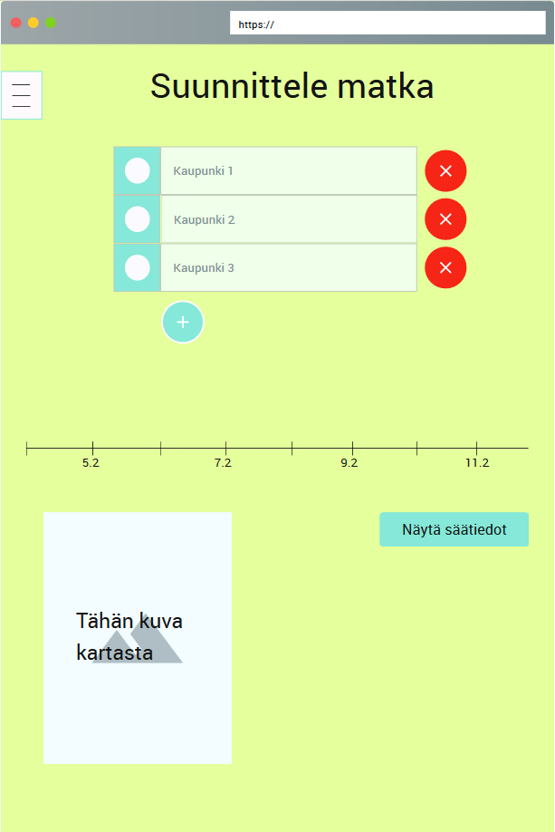

# Ominaisuus - Matkan suunnittelu

| | |
|:-:|:-:|
| Ominaisuus ID |esim. FT0101 |
| Osajärjestelmä, mihin ominaisuus liittyy |  |
| Ominaisuuden vastuuhenkilö | Koko tiimi |
| Status | Hyväksytty |

### Kuvaus

Käyttäjä voi luoda itselleen useita sijainteja sisältäviä matkoja ja valita niille päivät.
Luodun matkan säätietoja voi tarkistella sliderin avulla, joka liikkuu matkan päivien kohdalla

### Ominaisuuteen liittyvät rajaukset, vaatimukset käyttötapaukset

| | |
|:-:|:-:|
| US-01 | Retkeilijänä haluan saada tietää eri paikkojen säästä hyvissä ajoin etukäteen, koska en viivy kauaa yhdessä paikassa.|
| FUNCTIONAL-REQ-C0006 | Käyttäjä voi suunnitella matkan | 
| FUNCTIONAL-REQ-C0007 | Käyttäjä voi katsoa sään haluamalleen ajankohdalle | 
| FUNCTIONAL-REQ-C0008 | Sovellus tarkistaa paikkakuntien oikeellisuuden |

### Alustavat käyttäjätarinat (User Storys)

* [As a camper, I want to see the forecast for different places, because I don't stay in the same location for long](https://gitlab.labranet.jamk.fi/team-b-2019/core/issues/132)

### Käyttöliittymänäkymä/mock 

### Testaus / mahdolliset hyväksyntä kriteerit 

*Kirjataan muutamia huomiota testauksen kannalta*

| Testitapaus  | Testin lähde  | Kuka vastaa  |
|:-: | :-:|:-:|
| [Testitapaus 1]()  | vaatimus id?   |   |
| [Testitapaus 2]()  | vaatimus id?   |   |
| [Testitapaus 3]()  | vaatimus id?   |   |
| [Testitapaus 4]()  | vaatimus id?   |   |
| | |

