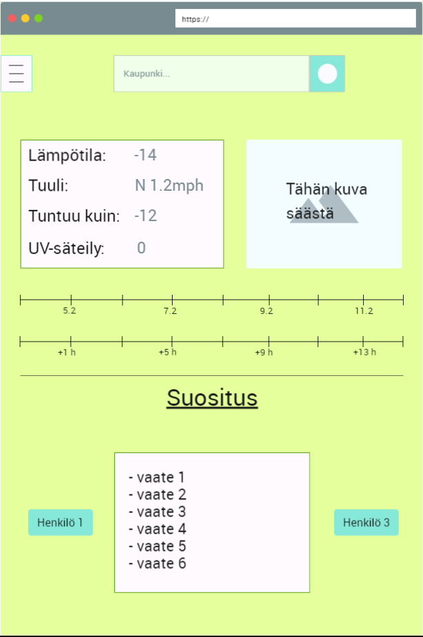

# Ominaisuus 4 - Sääinfo

| | |
|:-:|:-:|
| Ominaisuus ID | FT04 |
| Osajärjestelmä | Rajapinnat |
| Ominaisuuden vastuuhenkilö | - |
| Status | Ei aloitettu |

### Kuvaus

* [Julkaisusuunnitelman ominaisuus](../../04-julkaisusuunnitelma/Featuret/Sääinfo.md)

Infolaatikko sivuilla, josta näkee valitun päivän ja siitä valitun tunnin säätiedot.

### Ominaisuuteen liittyvät rajaukset, vaatimukset käyttötapaukset

| | |
|:-:|:-:|
| PERFORMANCE-REQ-0001 | Säätietojen hakemisessa ei kestä yli 2 sek |
| FUNCTIONAL-REQ-C0007 | Käyttäjä voi katsoa sään haluamalleen ajankohdalle |

### Alustavat käyttäjätarinat (User Storys)

[#132 - As a camper, I want to see the forecast for different places, because I don't stay in the same location for long](#132)

### Käyttöliittymänäkymä/mock 

### Testaus / mahdolliset hyväksyntä kriteerit 

| Testitapaus  | Testin lähde  | Kuka vastaa  |
|:-: | :-:|:-:|
| [Testitapaus 1]()  | vaatimus id?   |   |