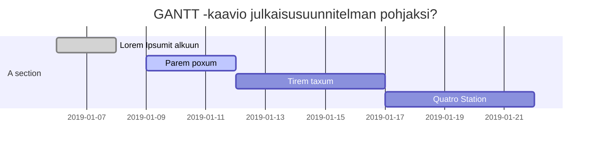

# Palvelun/tuotteen vaatimusmäärittely

# WR Wear-right

* Team Hydralist
* Jäsenet
    * Claudia Viita @L4710
    * Jesse Heikkinen @L4160
    * Mikko Martikainen @K8936
    * Mikko Vornanen @L9696
    * Oskari Seppä @M0375
    * Suvi Lauritsalo @L4086
* 2019
* Versionumero 0.1

## Sisällysluettelo 

* [Tuotteen kuvaus](#Johdatus)
* [Palvelukuvaus](#Palvelukuvaus)
* [Asiakastarina](#Johdatus)
* [Sidosryhmät ja profiilikuvaukset]()
* [Sidosryhmäkuva]()
* [Palvelu/asiakaspolku]()
* [Yleinen käyttötapaus]()
* [Yleiset toiminnalliset vaatimukset]()
* [Yleiset ei-toiminnalliset vaatimukset]()
* [Palvelu MockUp]()
* [Tärkeimmät ominaisuudet]()
* [Julkaisun suunnitelma]()
* [Palvelun/ohjelmiston arkkitehtuuri]()
* [Testaus ja laadunvarmistus]()
* [Lähteet]()

# Johdatus

_WR Wear-right_ on palvelu, joka tarjoaa ohjeistusta pukeutumiseen sään mukaan. Sovellus suunnittelee pukeutumisen paikkakuntakohtaisesti sekä iän ja sukupuolen mukaan. 
Käyttäjän on mahdollista luoda itselleen sivuprofiileja, jolloin palvelu antaa pukeutumissuositukset myös niille.
Palvelun avulla on myös mahdollista suunnitella matka sekä saada pukeutumisohjeet kyseiselle ajalle paikkakuntakohtaisesti.

Projektista laaditaan asianmukainen dokumentaatio ja työn edistymistä seurataan ylläpidettävällä seurannalla. Projektin tavoitteena on kehittää tuote,
joka voi olla keskeneräinen, mutta antaa kuvan siitä millainen tuote tulisi olemaan. Suunnitelma hyväksytetään toimeksiantajalla ennen toteutusta. 

Toteutuksessa käytettävien teknologioiden sekä palvelujen kartoittaminen tapahtuu ryhmän toimesta. 

## Vaatimusmäärittelytyön tilaaja

WR - Wear-Right

## Vaatimusmäärittelyn toimittaja

Ryhmä B - Team hydralist, joka koostuu viidestä toisen vuoden tieto- ja viestintätekniikan opiskelijasta.

# Palvelukuvaus

Palvelun pääasiallinen tehtävä on näyttää säätiedot halutulta ajalta ja suunnitella vaatetus tilanteen mukaan. Vaatetukseen vaikuttaa sään lisäksi myös henkilön ikä ja sukupuoli, jotka käyttäjä määrittelee profiilin luomisen yhteydessä.
Toisena pääominaisuutena käyttäjän on mahdollista luoda sivuprofiilejä, joiden vaatetuksen palvelu myös suunnittelee. Sovelluksessa on myös mahdollista suunnitella matka jonka mukaan palvelu päättelee vaatteiden tarpeen eri päiville ja paikkakunnille.

## Valitut asiakastarinat

Lasse Lehtinen: Lassen työ vie häntä eri puolille suomea lyhyellä varoitus ajalla ja joskus pitemmäksikin aikaa. Lasse tykkää harrastaa ulkoilma
lajeja mm. hiihtämistä ja tennistä, joten työmatkat ovat tähän otollisia, koska iltaisin Lassella on hyvää aikaa nauttia harrastuksistaan.
Lasse joutuu kuitenkin aina ennen työmatkojaan seuraamaan säätiedotuksia hyvin tarkkaan ja joskus jopa useammalta eri paikkakunnalta. Tämän takia
Lasse käyttää Wear-Right web-sovellusta. Lasse näkee sovelluksesta suoraan minkälaisia vaatteita hän tarvitsee työmatkalle mukaan ja minkälaista
säätä matkalle on luvassa. Kaiken tämän Lasse näkee yhdestä samasta palvelusta.

Minna Järvenpää: Minnalla aamut ovat kiireisä. Hänen täytyy tehdä aamupalat lapsille, pitää huoli heidän aamutoimistaan ja tarkistaa päivän sää ja pukea
heidät oikein sekä pakata mukaan tarvittavat vaatteet mikäli sää päivän aikana muuttuu. Kaiken tämän Minna joutuu tekemään ennen oman työpäivänsä alkamista.
Minna on kuitenkin keksinyt tavan säästää aikaa aamuisin käyttämällä Wear-Right web-sovellusta. Sovelluksen avulla Minna näkee aamuisin suoraan mitä 
vaatteita lapset tarvitsevat päällensä ja mukaansa päiväkotiin ja kouluun. Enää Minnan ei tarvitse käydä hakemassa itse tuntikohtaista säätiedotusta joka aamu
vaan hän näkee sen suoraan sovelluksesta sekä tarvittavat vaatteet lapsikohtaisesti.

## Yleinen sidosryhmäkuva (Stakeholder map)

## Tunnistetut sidosryhmäkuvaukset (Stakeholders) 

* [Asiakas](profiilit/stakeholder-profile1.md)

Asiakas käyttää palvelua helpottaakseen pukeutumissuunnittelua. Asiakas hyötyy palvelun käytöstä ajallisesti.

* [Uhka](profiilit/stakeholder-profile4.md)

Palvelun uhkana ovat black-hat hakkerit. Hakkerit kaatavat sivuja harrastuksenaan tai rahallisen hyödyn takia.

* [Kehittäjä](profiilit/stakeholder-profile5.md)

Palvelun kehittäjät kehittävät palvelua, joko tekemällä palvelua valmiiksi tai palvelun tekemisen jälkeen
kehittämällä palvelua paremmaksi

## Palvelu/asiakaspolku (Customer Journey/Path)

**Käy läpi yksittäinen asiakaspolku piirtäen se esim Swimlane/BluePrint/tilakone -kuvauksena. Asiakaspolku voi olla aluksi tekstimuotoinen ja se piirretään sen pohjalta**

**Asiakaspolun voi kirjoittaa auki käyttäen aiemmin määriteltyjä profiileja..** 

Esim. 

Sed ut [Profile 1](stakeholder-profile1.md) perspiciatis unde omnis iste natus error sit voluptatem accusantium doloremque laudantium, 
totam rem aperiam, eaque ipsa quae ab illo inventore veritatis et quasi architecto beatae vitae 
dicta sunt explicabo. Nemo enim ipsam voluptatem quia voluptas sit aspernatur aut odit aut fugit, 
sed quia consequuntur magni dolores eos qui [Profile 1](stakeholder-profile1.md) ratione voluptatem sequi nesciunt. 
Neque porro quisquam est, [Profile 3](stakeholder-profile3.md)
qui dolorem ipsum quia dolor sit amet, consectetur, adipisci velit, sed quia non numquam eius modi tempora 
incidunt ut labore et dolore magnam aliquam quaerat voluptatem. Ut enim ad minima veniam, 
quis nostrum exercitationem ullam corporis suscipit laboriosam, nisi ut aliquid ex ea commodi consequatur?

**Polkuja kannattaa määritellä useampia useita eri tilanteiden pohjalta. Yhteen kuvaukseen ei kannata upottaa liikaa tapahtumia**

* Mieti onko mahdollista hyödynnetään jotain ulkopuolista palvelua kuvauksen apuna?

Esim. Canvanizer https://canvanizer.com

# Vaatimukset, käyttötapaukset ja ominaisuudet

## Tuotteen järjestelmävaatimukset ja mahdolliset rajoitukset (Key Requirements and restrictions)

__Kirjaa tähän tärkeimmät vaatimukset suunnitteltuun palveluun liittyen__

tekstiä 

Voit esittää ne taulukossa tai viitata [yhteen](pohjat/pohja-vaatimuslistalle.md) laajempaan kokonaisuuteen

| VaatimusID | Tyyppi | Kuvaus | Ominaisuus johon vaikuttaa |								
|:-:|:-:|:-:|:-:|
| SYSTEM-REQ-0001 | System Requirement | Kirjatumispalvelulla on oltava itsenäinen kolmannen osapuolen toimittama varmistusjärjestelmä | [Kirjautuminen ft1](ft1-ominaisuus.md) |
| SYSTEM-REQ-0002 | System Requirement | Palvelun tärkeimpien palvelujen on oltava vähintään kahdennettu N+1 | |
| SYSTEM-REQ-0003 | System Requirement |||
| SYSTEM-REQ-0004 | System Requirement |||
| SYSTEM-REQ-0005 | System Requirement |||

# Oleelliset huomioitavat rajoitteet

| Id | Vaatimuksen kuvaus | kategoria | Vastuullinen |
|:-:|:-:|:-:|:-:|
| CONSTRAINT-REQ-S00000 | Constrain | Palvelun kirjautumisprosessin on noudatettava AC5-2009-käytäntöä  | [Kirjautuminen ft1](ft1-ominaisuus.md) |
| CONSTRAINT-REQ-S00001 | Constrain |||
| CONSTRAINT-REQ-S00002 | Constrain |||
| CONSTRAINT-REQ-S00003 | Constrain |||
| CONSTRAINT-REQ-S00004 | Constrain |||
| CONSTRAINT-REQ-S00005 | Constrain |||
| CONSTRAINT-REQ-S00006 | Constrain |||

## Tärkeimmät käyttötapaukset (General Use Cases)

**Millaisia ovat tärkeimmät käyttötapaukset (Use Caset) tuotteeseen/palveluun liittyen? Muista, ettei käyttötapauksella ei tarkoiteta käyttökohdetta/soveltamiskohdetta**

tekstiä

**Esimerkit**

* [Käyttötapaus 1 - Uusi asiakas luo tunnuksen]()
* [Käyttötapaus 2 - Uusi asiaks poistaa tunnukset]()

## Alustavat User Storyt

| US-ID | Kuvaus | Ominaisuus johon vaikuttaa |								
|:-:|:-:|:-:|
| US-01 | Retkeilijänä haluan saada tietää eri paikkojen säästä hyvissä ajoin etukäteen, koska en viivy kauaa yhdessä paikassa. | [Sääennustus ft6](ft6-ominaisuus.md) |
| US-02 | Lapsiperheen äitinä haluan, että pääsen näkemään nopeasti lapsille säähän sopivat vaatteet, koska olen hyvin kiireinen ihminen. | [Lasten vaatetus ft9](ft9-ominaisuus.md) |
| US-01 | Käyttäjänä haluan, että tietoni pysyisi sovelluksen tiedoissa, koska se olisi kätevää. | [Käyttäjätiedot ft2](ft2-ominaisuus.md) |

## Palveluun liittyvät tärkeimmät toiminnalliset vaatimukset (Functional Requirements)

tekstiä

**Mitä ovat toiminnalliset vaatimukset?**

Voit esittää ne taulukossa tai viitata [yhteen](pohjat/pohja-vaatimuslistalle.md) laajempaan kokonaisuuteen

| VaatimusID | Tyyppi | Kuvaus | Ominaisuus johon vaikuttaa |								
|:-:|:-:|:-:|:-:|
| FUNCTIONAL-REQ-C0001 | Functional Requirement | Käyttäjä pystyy luomaan oman profiilin | [Kirjautuminen ft1](ft1-ominaisuus.md) |
| FUNCTIONAL-REQ-C0002 | Functional Requirement | Käyttäjä pystyy luomaan yhden tai useampia sivuprofiileja ||
| FUNCTIONAL-REQ-C0003 | Functional Requirement | Päänäkymässä näkyy ajankohtainen sää ||
| FUNCTIONAL-REQ-C0004 | Functional Requirement | Päänäkymässä näkyy pukeutumissuositukset ||
| FUNCTIONAL-REQ-C0005 | Functional Requirement |||
| FUNCTIONAL-REQ-C0006 | Functional Requirement |||
| FUNCTIONAL-REQ-C0007 | Functional Requirement |||
| FUNCTIONAL-REQ-C0008 | Functional Requirement |||
| FUNCTIONAL-REQ-C0009 | Functional Requirement |||
| FUNCTIONAL-REQ-C0010 | Functional Requirement |||

## Palveluun liittyvät tärkeimmät ei-toiminnalliset vaatimukset (Non Functional Requirements)

__Mitä olivat ei-toiminnalliset vaatimukset?__

Voit esittää eri vaatimuksia erillisessä taulukossa tai viitata tässä [yhteen](pohjat/pohja-vaatimuslistalle.md) laajempaan taulukkoon..

tekstiä

### Suorituskyky? (Performance)

tekstiä

Voit esittää eri vaatimuksia erillisessä taulukossa tai viitata tässä [yhteen](pohjat/pohja-vaatimuslistalle.md) laajempaan taulukkoon..

| VaatimusID | Tyyppi | Kuvaus | Ominaisuus johon vaikuttaa |								
|:-:|:-:|:-:|:-:|
| PERFORMANCE-REQ-0000 | Non-Functional Performance | Kirjautuminen on mahdollista yhtäaikaa 100 käyttäjällä (100 request/s) | [Kirjautuminen ft1](ft1-ominaisuus.md) |								
| PERFORMANCE-REQ-0001 | Non-Functional Performance |||
| PERFORMANCE-REQ-0002 | Non-Functional Performance |||
| PERFORMANCE-REQ-0003 | Non-Functional Performance |||
| PERFORMANCE-REQ-0004 | Non-Functional Performance |||
| PERFORMANCE-REQ-0005 | Non-Functional Performance |||

### Tietoturva?

tekstiä

Voit esittää eri vaatimuksia erillisessä taulukossa tai viitata tässä [yhteen](pohjat/pohja-vaatimuslistalle.md) laajempaan taulukkoon..

| VaatimusID | Tyyppi | Kuvaus | Ominaisuus johon vaikuttaa |								
|:-:|:-:|:-:|:-:|
| SECURITY-REQ-0001 | Non-Functional Security | Salasanassa on käytettävä vähintään MD5-tason salausta, koska standardi XY112 sitä edellyttää | [Kirjautuminen ft1](ft1-ominaisuus.md) |								
| SECURITY-REQ-0002 | Non-Functional Security |||
| SECURITY-REQ-0003 | Non-Functional Security |||
| SECURITY-REQ-0004 | Non-Functional Security |||
| SECURITY-REQ-0005 | Non-Functional Security |||
| SECURITY-REQ-0006 | Non-Functional Security |||
| SECURITY-REQ-0007 | Non-Functional Security |||
| SECURITY-REQ-0008 | Non-Functional Security |||
| SECURITY-REQ-0009 | Non-Functional Security |||
| SECURITY-REQ-0010 | Non-Functional Security |||

### Käytettävyys

tekstiä

Voit esittää eri vaatimuksia erillisessä taulukossa tai viitata tässä [yhteen](pohjat/pohja-vaatimuslistalle.md) laajempaan taulukkoon..

| VaatimusID | Tyyppi | Kuvaus | Ominaisuus johon vaikuttaa |								
|:-:|:-:|:-:|:-:|
| USABILITY-REQ-0000 | Non-Functional Usability | Käyttöliittymän on toimittava myös ääniohjattuna, koska käyttäjillä saattaa olla näkövammoja |  [Kirjautuminen ft1](ft1-ominaisuus.md) | |	
| USABILITY-REQ-0001 | Non-Functional Usability |||
| USABILITY-REQ-0002 | Non-Functional Usability |||
| USABILITY-REQ-0003 | Non-Functional Usability |||
| USABILITY-REQ-0004 | Non-Functional Usability |||
| USABILITY-REQ-0005 | Non-Functional Usability |||

### Testattavuus

| VaatimusID | Tyyppi | Kuvaus | Ominaisuus johon vaikuttaa |								
|:-:|:-:|:-:|:-:|
| TESTABILITY-REQ-0000 | Non-Functional Testability | Käyttäjärekisteri on kyettävä palauttamaan alkutilaan ennen testien ajoa  | [Kirjautuminen ft1](ft1-ominaisuus.md)	 |	
| TESTABILITY-REQ-0001 | Non-Functional Testability |||	
| TESTABILITY-REQ-0002 | Non-Functional Testability |||	
| TESTABILITY-REQ-0003 | Non-Functional Testability |||	
| TESTABILITY-REQ-0004 | Non-Functional Testability |||	
| TESTABILITY-REQ-0005 | Non-Functional Testability |||

## Palvelu MockUp-prototyyppi

Tässä on palvelun prototyyppi:

[WR wear-right](https://www.fluidui.com/editor/live/preview/cF9TeGhTZkFtcE04NGZCUHc5NTNMa3N4M1RwSDNrUzVOVg==)

## Tärkeimmät tunnistetut ominaisuudet/piirteet (Features)

tekstiä

**Mieti ovatko kaikki ominaisuudet tarpeellisia?**

| Ominaisuus | Prioriteetti | Muuta |
| :-: | :-: | :-: |
| [Ominaisuus 1 - Feature 1](pohjat/pohja-ominaisuus.md) | Tärkeä | |
| [Ominaisuus 2](pohjat/pohja-ominaisuus.md) | Tärkeä | |
| [Ominaisuus 3](pohjat/pohja-ominaisuus.md) | Pakollinen | |
| [Ominaisuus 4](pohjat/pohja-ominaisuus.md) | Nice to Have | |
| [Ominaisuus 5](pohjat/pohja-ominaisuus.md) | | |

## Hyväksyntätestit

**Kiinnitetään alustavat hyväksyntätestit vaatimuksiin taulukon muodossa**

| VaatimusID | Testitapaus | Kuvaus |  |								
|:-:|:-:|:-:|:-:|
| USE-CASE-007,SYSTEM-REQ-0001,SYSTEM-REQ-0004, SYSTEM-REQ-0012 | [Test Case Id X](Linkki testiin) | Hyväksyntätesti  |
| USE-CASE-017,SYSTEM-REQ-0011,SYSTEM-REQ-0004, SYSTEM-REQ-0012 | [Test Case Id Y](Linkki testiin) | Hyväksyntätesti  |
| USE-CASE-011,USE-CASE-013,SYSTEM-REQ-0204, SYSTEM-REQ-0212 | [Test Case Id Z](Linkki testiin) | Hyväksyntätesti  |
| USE-CASE-002,SYSTEM-REQ-0301,SYSTEM-REQ-0304, SYSTEM-REQ-0312 | [Test Case Id O](Linkki testiin) | Hyväksyntätesti  |

## Julkaisun suunnitelma

Perinteinen listaus

| Aika + Ominaisuuus | Kuvaus | Vastuu | Prioriteetti |
|:-:|:-:|:-:|:-:|
| 1.9.2019 [Ominaisuus 1](pohjat/pohja-ominaisuus.md) | | |
| 1.10.2019 [Ominaisuus 2](pohjat/pohja-ominaisuus.md) | | |
| 15.11.2019 [Ominaisuus 3](pohjat/pohja-ominaisuus.md) | | |
| 5.12.2019 [Ominaisuus 4](pohjat/pohja-ominaisuus.md) | | |

Tutustu Mermaid skriptiin?

# Palvelun/ohjelmiston arkkitehtuuri 

### Yleinen sijoittelunäkymä (Deployment diagram )

# Arkkitehtuuriin/teknologiaan liityvät vaatimukset

### Tekniset vaatimukset 

| Id | Vaatimuksen kuvaus | kategoria | Vastuullinen |
|:-:|:-:|:-:|:-:|
| REQ00x | Vaatimus? | Yllläpito | Kuka vastaa | 
| REQ00x | Vaatimus? | Tekninen | Kuka vastaa | 
| REQ00x | Vaatimus? | Käytettävyys | Kuka vastaa | 
| REQ00x | Vaatimus? | Käytettävyys | Kuka vastaa | 
| REQ00x | Vaatimus? | Käytettävyys | Kuka vastaa | 

### Ylläpito (Maintenance)

_Tähän kirjataan vaatimuksia, joiden merkitys tulee esiin vasta tuotteen julkaisun jälkeen. Miten tuotteen ylläpidettävyyttä parannetaan? Mitä pitää ottaa huomioon, että ylläpidettävyys on helpompaa__

| Id | Vaatimuksen kuvaus | kategoria | Vastuullinen |
|:-:|:-:|:-:|:-:|
| REQ00x | Vaatimus? | Yllläpito | Kuka vastaa | 
| REQ00x | Vaatimus? | Tekninen | Kuka vastaa | 
| REQ00x | Vaatimus? | Käytettävyys | Kuka vastaa | 
| REQ00x | Vaatimus? | Käytettävyys | Kuka vastaa | 
| REQ00x | Vaatimus? | Käytettävyys | Kuka vastaa | 

### Tietokantakuvaus (Database ER-diagram)

 Tähän esim alustava __ER-kaavio__

# Testauksen vaatimukset (Testing requirements)

### Testattavuus

| Id | Vaatimuksen kuvaus | kategoria | Vastuullinen |
|:-:|:-:|:-:|:-:|
| REQ00x | Vaatimus? | Testattavuus | Kuka vastaa | 
| REQ00x | Vaatimus? | Testattavuus | Kuka vastaa | 
| REQ00x | Vaatimus? | Testattavuus | Kuka vastaa | 
| REQ00x | Vaatimus? | Testattavuus | Kuka vastaa | 
| REQ00x | Vaatimus? | Testattavuus | Kuka vastaa | 

# Tunnistetut riskit ja testikohteet

* Riski -> Testaustarve
* Vaatimus -> Testaustarve

### Kaikki vaatimukset listattuna

**Tähän osaan voidaan linkittää vaatimuslista, josta kaikki tunnistetut vaatimukset löytyvät**

* [Linkki vaatimuslistaan](pohjat/vaatimuslista.md)

### Dokumentit, standardit ja lähteet

tekstiä

*Lähteet/Standardit/Suositukset*

| ID | Linkki |  |  
|:-:|:-:|:-:|
| JHS 165 ICT | http://www.jhs-suositukset.fi/c/document_library/get_file?uuid=b8118ad7-8ee4-459a-a12b-f56655e4ab9d&groupId=14 | Vaatimusmäärittely |
| SO 9241-11 | https://fi.wikipedia.org/wiki/K%C3%A4ytett%C3%A4vyys  | Käytettävyys | 
| ISO9001 | https://www.sfs.fi/julkaisut_ja_palvelut/tuotteet_valokeilassa/iso_9000_laadunhallinta/iso_9001_2015  | - | 
| - | -  | - | 
