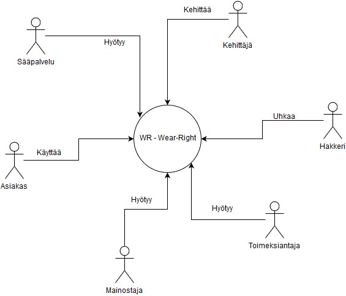
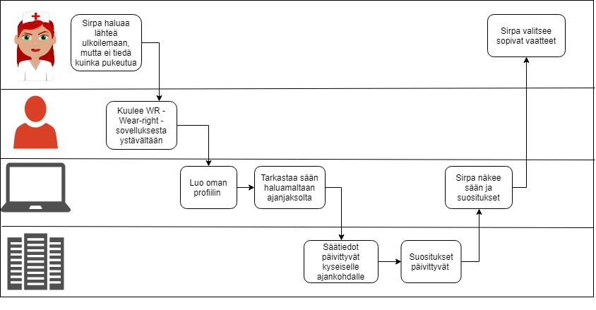
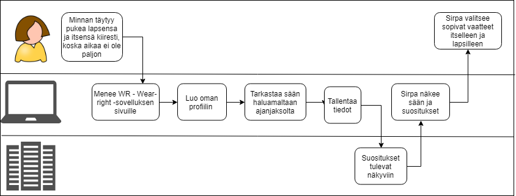
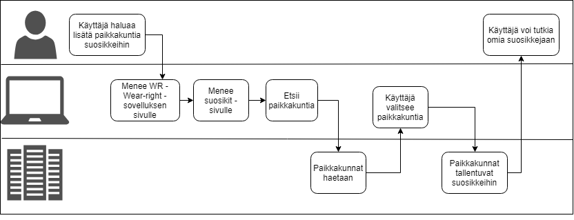
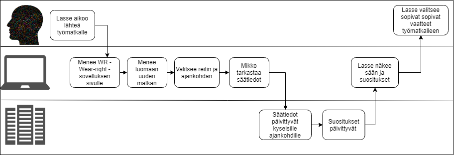

# Palvelun/tuotteen vaatimusmäärittely

# WR Wear-right

* Team Hydralist
* Jäsenet
    * Claudia Viita @L4710
    * Jesse Heikkinen @L4160
    * Mikko Martikainen @K8936
    * Mikko Vornanen @L9696
    * Oskari Seppä @M0375
    * Suvi Lauritsalo @L4086
* 2019
* Versionumero 0.1

## Sisällysluettelo 

* [Tuotteen kuvaus](#Johdatus)
* [Palvelukuvaus](#Palvelukuvaus)
* [Asiakastarina](#Johdatus)
* [Sidosryhmät ja profiilikuvaukset]()
* [Sidosryhmäkuva]()
* [Palvelu/asiakaspolku]()
* [Yleinen käyttötapaus]()
* [Yleiset toiminnalliset vaatimukset]()
* [Yleiset ei-toiminnalliset vaatimukset]()
* [Palvelu MockUp]()
* [Tärkeimmät ominaisuudet]()
* [Julkaisun suunnitelma]()
* [Palvelun/ohjelmiston arkkitehtuuri]()
* [Testaus ja laadunvarmistus]()
* [Lähteet]()

# Johdatus

_WR Wear-right_ on palvelu, joka tarjoaa ohjeistusta pukeutumiseen sään mukaan. Sovellus suunnittelee pukeutumisen paikkakuntakohtaisesti sekä iän ja sukupuolen mukaan. 
Käyttäjän on mahdollista luoda itselleen sivuprofiileja, jolloin palvelu antaa pukeutumissuositukset myös niille.
Palvelun avulla on myös mahdollista suunnitella matka sekä saada pukeutumisohjeet kyseiselle ajalle paikkakuntakohtaisesti.

Projektista laaditaan asianmukainen dokumentaatio ja työn edistymistä seurataan ylläpidettävällä seurannalla. Projektin tavoitteena on kehittää tuote,
joka voi olla keskeneräinen, mutta antaa kuvan siitä millainen tuote tulisi olemaan. Suunnitelma hyväksytetään toimeksiantajalla ennen toteutusta. 

Toteutuksessa käytettävien teknologioiden sekä palvelujen kartoittaminen tapahtuu ryhmän toimesta. 

## Vaatimusmäärittelytyön tilaaja

WR - Wear-Right

## Vaatimusmäärittelyn toimittaja

Ryhmä B - Team hydralist, joka koostuu viidestä toisen vuoden tieto- ja viestintätekniikan opiskelijasta.

# Palvelukuvaus

Palvelun pääasiallinen tehtävä on näyttää säätiedot halutulta ajalta ja suunnitella vaatetus tilanteen mukaan. Vaatetukseen vaikuttaa sään lisäksi myös henkilön ikä ja sukupuoli, jotka käyttäjä määrittelee profiilin luomisen yhteydessä.
Toisena pääominaisuutena käyttäjän on mahdollista luoda sivuprofiilejä, joiden vaatetuksen palvelu myös suunnittelee. Sovelluksessa on myös mahdollista suunnitella matka jonka mukaan palvelu päättelee vaatteiden tarpeen eri päiville ja paikkakunnille.

## Valitut asiakastarinat

Lasse Lehtinen: Lassen työ vie häntä eri puolille suomea lyhyellä varoitus ajalla ja joskus pitemmäksikin aikaa. Lasse tykkää harrastaa ulkoilma
lajeja mm. hiihtämistä ja tennistä, joten työmatkat ovat tähän otollisia, koska iltaisin Lassella on hyvää aikaa nauttia harrastuksistaan.
Lasse joutuu kuitenkin aina ennen työmatkojaan seuraamaan säätiedotuksia hyvin tarkkaan ja joskus jopa useammalta eri paikkakunnalta. Tämän takia
Lasse käyttää Wear-Right web-sovellusta. Lasse näkee sovelluksesta suoraan minkälaisia vaatteita hän tarvitsee työmatkalle mukaan ja minkälaista
säätä matkalle on luvassa. Kaiken tämän Lasse näkee yhdestä samasta palvelusta.

Minna Järvenpää: Minnalla aamut ovat kiireisä. Hänen täytyy tehdä aamupalat lapsille, pitää huoli heidän aamutoimistaan ja tarkistaa päivän sää ja pukea
heidät oikein sekä pakata mukaan tarvittavat vaatteet mikäli sää päivän aikana muuttuu. Kaiken tämän Minna joutuu tekemään ennen oman työpäivänsä alkamista.
Minna on kuitenkin keksinyt tavan säästää aikaa aamuisin käyttämällä Wear-Right web-sovellusta. Sovelluksen avulla Minna näkee aamuisin suoraan mitä 
vaatteita lapset tarvitsevat päällensä ja mukaansa päiväkotiin ja kouluun. Enää Minnan ei tarvitse käydä hakemassa itse tuntikohtaista säätiedotusta joka aamu
vaan hän näkee sen suoraan sovelluksesta sekä tarvittavat vaatteet lapsikohtaisesti.

## Yleinen sidosryhmäkuva (Stakeholder map)

## Tunnistetut sidosryhmäkuvaukset (Stakeholders) 

* [Asiakas](profiilit/stakeholder-profile1.md)

Asiakas käyttää palvelua helpottaakseen pukeutumissuunnittelua. Asiakas hyötyy palvelun käytöstä ajallisesti.

* [Uhka](profiilit/stakeholder-profile4.md)

Palvelun uhkana ovat black-hat hakkerit. Hakkerit kaatavat sivuja harrastuksenaan tai rahallisen hyödyn takia.

* [Kehittäjä](profiilit/stakeholder-profile5.md)

Palvelun kehittäjät kehittävät palvelua, joko tekemällä palvelua valmiiksi tai palvelun tekemisen jälkeen
kehittämällä palvelua paremmaksi

## Palvelu/asiakaspolku (Customer Journey/Path)

Sirpa Sirviön asiakaspolku. Hän haluaa lähteä ulkoilemaan koiransa kanssa.

Minna Järvenpään asiakaspolku. Hänellä on kiire pukea lapsensa päiväkotiin ja kouluun.

Kolmas aiakaspolku. Asiakas haluaa lisätä itselleen paikkakuntia suosikkeihin.

Lasse Lehtisen asiakaspolku. Hän aikoo lähteä työmatkalle.

# Vaatimukset, käyttötapaukset ja ominaisuudet

## Tuotteen järjestelmävaatimukset ja mahdolliset rajoitukset (Key Requirements and restrictions)

| VaatimusID | Tyyppi | Kuvaus | Ominaisuus johon vaikuttaa |								
|:-:|:-:|:-:|:-:|
| SYSTEM-REQ-0001 | System Requirement | Palvelun täytyy tallentaa tietoja tietokoneen paikalliseen muistiin | |
| SYSTEM-REQ-0002 | System Requirement | Sovellus tukee eri selaimia | |
| SYSTEM-REQ-0003 | System Requirement | Sovellus skaalautuu mobiiliin | |
| SYSTEM-REQ-0004 | System Requirement | Sovellus saa säätiedot avoimesta rajapinnasta ||

# Oleelliset huomioitavat rajoitteet

| Id | Vaatimuksen kuvaus | kategoria | Vastuullinen |
|:-:|:-:|:-:|:-:|
| CONSTRAINT-REQ-S00000 | Constrain | Palveluun ei tallenneta henkilötietoja  | [Kirjautuminen ft1](ft1-ominaisuus.md) |

## Tärkeimmät käyttötapaukset (General Use Cases)

* [Käyttötapaus 1 - Uusi asiakas luo tunnuksen]()
* [Käyttötapaus 2 - Uusi asiaks poistaa tunnukset]()

## Alustavat User Storyt

| US-ID | Kuvaus | Ominaisuus johon vaikuttaa |								
|:-:|:-:|:-:|
| US-01 | Retkeilijänä haluan saada tietää eri paikkojen säästä hyvissä ajoin etukäteen, koska en viivy kauaa yhdessä paikassa. | [Sääennustus ft6](ft6-ominaisuus.md) |
| US-02 | Lapsiperheen äitinä haluan, että pääsen näkemään nopeasti lapsille säähän sopivat vaatteet, koska olen hyvin kiireinen ihminen. | [Lasten vaatetus ft9](ft9-ominaisuus.md) |
| US-03 | Käyttäjänä haluan, että tietoni pysyisi sovelluksen tiedoissa, koska se olisi kätevää. | [Käyttäjätiedot ft2](ft2-ominaisuus.md) |

## Palveluun liittyvät tärkeimmät toiminnalliset vaatimukset (Functional Requirements)

| VaatimusID | Tyyppi | Kuvaus | Ominaisuus johon vaikuttaa |								
|:-:|:-:|:-:|:-:|
| FUNCTIONAL-REQ-C0001 | Functional Requirement | Käyttäjä pystyy luomaan oman profiilin | [Kirjautuminen ft1](ft1-ominaisuus.md) |
| FUNCTIONAL-REQ-C0002 | Functional Requirement | Käyttäjä pystyy luomaan yhden tai useampia sivuprofiileja ||
| FUNCTIONAL-REQ-C0003 | Functional Requirement | Päänäkymässä näkyy ajankohtainen sää ||
| FUNCTIONAL-REQ-C0004 | Functional Requirement | Päänäkymässä näkyy pukeutumissuositukset ||
| FUNCTIONAL-REQ-C0005 | Functional Requirement | Käyttäjä voi hakea sään haluamaansa kaupunkiin||
| FUNCTIONAL-REQ-C0006 | Functional Requirement | Käyttäjä voi suunnitella matkan ||
| FUNCTIONAL-REQ-C0007 | Functional Requirement | Käyttäjä voi katsoa sään haluamalleen ajankohdalle ||
| FUNCTIONAL-REQ-C0008 | Functional Requirement | Sovellus tarkistaa paikkakuntien oikeellisuuden ||
| FUNCTIONAL-REQ-C0009 | Functional Requirement | Vaatesuositukset päivittyvät käyttäjän iän mukaisesti||

## Palveluun liittyvät tärkeimmät ei-toiminnalliset vaatimukset (Non Functional Requirements)

### Suorituskyky? (Performance)

| VaatimusID | Tyyppi | Kuvaus | Ominaisuus johon vaikuttaa |								
|:-:|:-:|:-:|:-:|
| PERFORMANCE-REQ-0000 | Non-Functional Performance | Säätietoja voi hakea 100 henkilöä minuutin aikana |  |
| PERFORMANCE-REQ-0001 | Non-Functional Performance | Säätietojen hakemisessa ei kestä yli 2 sek ||
| PERFORMANCE-REQ-0002 | Non-Functional Performance | Sivun latautumisessa ei kestä yli 2 sek ||

### Tietoturva?

| VaatimusID | Tyyppi | Kuvaus | Ominaisuus johon vaikuttaa |								
|:-:|:-:|:-:|:-:|
| SECURITY-REQ-0001 | Non-Functional Security | Käyttäjien sijaintitietoja ei saa päätyä palvelun ulkopuolelle  |  |
| SECURITY-REQ-0002 | Non-Functional Security | Säätietoja ei haeta rajapinnasta käyttäjätasolla | [Kirjautuminen ft1](ft1-ominaisuus.md) |	

### Käytettävyys

| VaatimusID | Tyyppi | Kuvaus | Ominaisuus johon vaikuttaa |								
|:-:|:-:|:-:|:-:|
| USABILITY-REQ-0000 | Non-Functional Usability |  Käyttöliittymä on yksinkertainen ja helppo käyttää |  [Kirjautuminen ft1](ft1-ominaisuus.md) | |	

### Testattavuus

| VaatimusID | Tyyppi | Kuvaus | Ominaisuus johon vaikuttaa |								
|:-:|:-:|:-:|:-:|
| TESTABILITY-REQ-0000 | Non-Functional Testability | Käyttäjärekisteri on kyettävä palauttamaan alkutilaan ennen testien ajoa  | [Kirjautuminen ft1](ft1-ominaisuus.md)	 |	
| TESTABILITY-REQ-0001 | Non-Functional Testability |||	
| TESTABILITY-REQ-0002 | Non-Functional Testability |||	
| TESTABILITY-REQ-0003 | Non-Functional Testability |||	
| TESTABILITY-REQ-0004 | Non-Functional Testability |||	
| TESTABILITY-REQ-0005 | Non-Functional Testability |||

## Palvelu MockUp-prototyyppi

Tässä on palvelun prototyyppi:

[WR wear-right](https://www.fluidui.com/editor/live/preview/cF9TeGhTZkFtcE04NGZCUHc5NTNMa3N4M1RwSDNrUzVOVg==)

## Tärkeimmät tunnistetut ominaisuudet/piirteet (Features)

| Ominaisuus | Prioriteetti | Muuta |
| :-: | :-: | :-: |
| [Ominaisuus 1 - profiilin luonti ](ominaisuudet/ominaisuus1.md) | Pakollinen | |
| [Ominaisuus 2 - sivuprofiilit](ominaisuudet/ominaisuus2.md) | Pakollinen | |
| [Ominaisuus 3 - Matkan suunnittelu](ominaisuudet/ominaisuus3.md) | Tärkeä | |
| [Ominaisuus 4 - Sääinfo](ominaisuudet/ominaisuus4.md) | Pakollinen | |

## Hyväksyntätestit

**Kiinnitetään alustavat hyväksyntätestit vaatimuksiin taulukon muodossa**

| VaatimusID | Testitapaus | Kuvaus |  |								
|:-:|:-:|:-:|:-:|
| USE-CASE-007,SYSTEM-REQ-0001,SYSTEM-REQ-0004, SYSTEM-REQ-0012 | [Test Case Id X](Linkki testiin) | Hyväksyntätesti  |
| USE-CASE-017,SYSTEM-REQ-0011,SYSTEM-REQ-0004, SYSTEM-REQ-0012 | [Test Case Id Y](Linkki testiin) | Hyväksyntätesti  |
| USE-CASE-011,USE-CASE-013,SYSTEM-REQ-0204, SYSTEM-REQ-0212 | [Test Case Id Z](Linkki testiin) | Hyväksyntätesti  |
| USE-CASE-002,SYSTEM-REQ-0301,SYSTEM-REQ-0304, SYSTEM-REQ-0312 | [Test Case Id O](Linkki testiin) | Hyväksyntätesti  |

## Julkaisun suunnitelma

[Julkaisusuunnitelma](../04-julkaisusuunnitelma/julkaisusuunnitelma.md)

# Palvelun/ohjelmiston arkkitehtuuri 

### Yleinen sijoittelunäkymä (Deployment diagram )

# Arkkitehtuuriin/teknologiaan liityvät vaatimukset

| Id | Vaatimuksen kuvaus | kategoria | Vastuullinen |
|:-:|:-:|:-:|:-:|
| REQ001 | Palvelinohjelmiston pitää vikatilanteessa käynnistyä uudelleen | Yllläpito |  |

### Tietokantakuvaus (Database ER-diagram)

 Tähän esim alustava __ER-kaavio__

# Testauksen vaatimukset (Testing requirements)

### Testattavuus

| Id | Vaatimuksen kuvaus | kategoria | Vastuullinen |
|:-:|:-:|:-:|:-:|
| REQ00x | Vaatimus? | Testattavuus | Kuka vastaa | 
| REQ00x | Vaatimus? | Testattavuus | Kuka vastaa | 
| REQ00x | Vaatimus? | Testattavuus | Kuka vastaa | 
| REQ00x | Vaatimus? | Testattavuus | Kuka vastaa | 
| REQ00x | Vaatimus? | Testattavuus | Kuka vastaa | 

# Tunnistetut riskit ja testikohteet

* Riski -> Testaustarve
* Vaatimus -> Testaustarve

### Kaikki vaatimukset listattuna

* [Linkki vaatimuslistaan](pohjat/vaatimuslista.md)

### Dokumentit, standardit ja lähteet

| ID | Linkki |  |  
|:-:|:-:|:-:|
| JHS 165 ICT | http://www.jhs-suositukset.fi/c/document_library/get_file?uuid=b8118ad7-8ee4-459a-a12b-f56655e4ab9d&groupId=14 | Vaatimusmäärittely |
| SO 9241-11 | https://fi.wikipedia.org/wiki/K%C3%A4ytett%C3%A4vyys  | Käytettävyys | 
| ISO9001 | https://www.sfs.fi/julkaisut_ja_palvelut/tuotteet_valokeilassa/iso_9000_laadunhallinta/iso_9001_2015  | - | 
| - | -  | - | 
