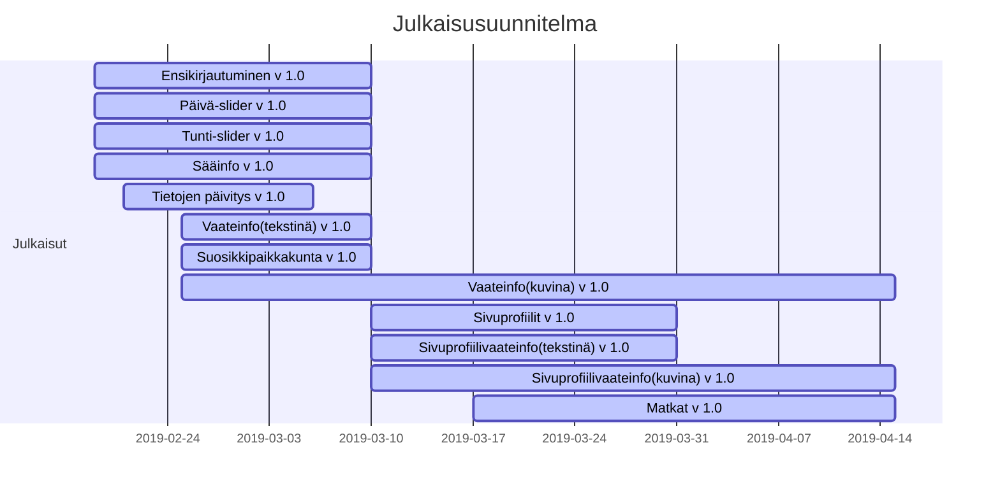

# Julkaisusuunnitelma

**Julkaisu "EarlyAdopter"**

Versio 1.0

**Konfiguraatio**

| Ominaisuus | Versio | Testattavissa | Julkaistaan |
|:-:|:-:|:-:|:-:|
| [Ensikirjautuminen](/Featuret/Ensikirjautuminen.md) | 1.0 | 25.02.2019 | 10.03.2019 |
| [Päivä-slider]() | 1.0 | 25.02.2019 | 10.03.2019 |
| [Tunti-slider]() | 1.0 | 25.02.2019 | 10.03.2019 |
| [Sääinfo]() | 1.0 | 25.02.2019 | 10.03.2019 |
| [Tietojen päivitys]() | 1.0 | 29.02.2019 | 06.03.2019 |
| [Vaateinfo(tekstinä)]() | 1.0 | 03.03.2019 | 10.03.2019 |
| [Suosikkipaikkakunta]() | 1.0 | 03.03.2019 | 10.03.2019 |
| [Vaateinfo(kuvina)]() | 1.0 | 30.03.2019 | TBD |
| [Sivuprofiilit]() | 1.0 | 15.03.2019 | 01.04.2019 |
| [Sivuprofiilivaateinfo(tekstinä)]() | 1.0 | 15.03.2019 | 01.04.2019 |
| [Sivuprofiilivaateinfo(kuvina)]() | 1.0 | 30.03.2019 | TBD|
| [Matkat]() | 1.0 | 30.03.2019 | TBD |

